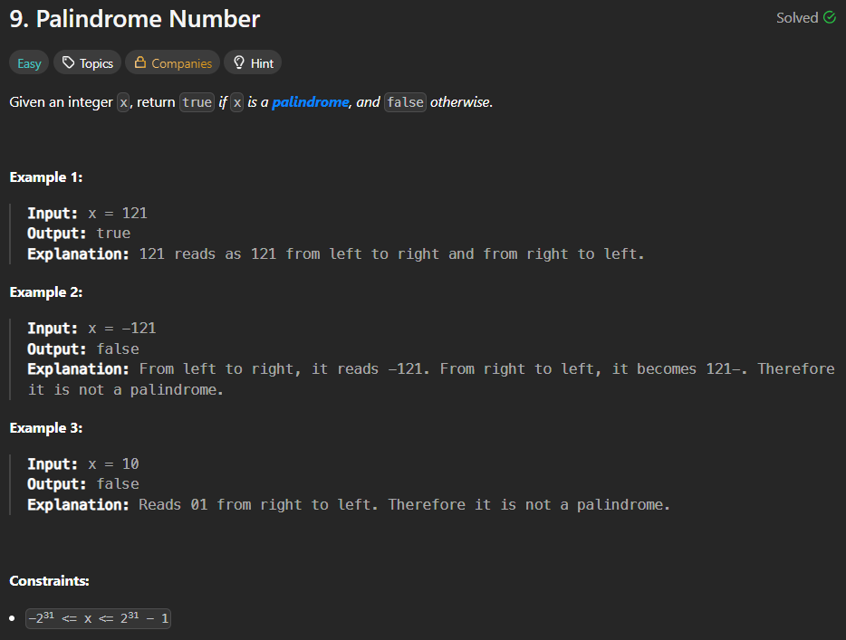

# Solution (Mathematical Approach)

## Code

```java
package A_Daily_Practice.Day_2;

public class PalindromeCheck {
    static void main() {
        System.out.println("121 is Palindrome? :" + Palidrome(121));
        System.out.println("-121 is Palindrome? :" + Palidrome(-1281));
        System.out.println("10 is Palindrome? :" + Palidrome(-10));
    }

    static boolean Palidrome(int x) {

        int xRev = 0;
        int xRem = 0;
        int temp = x;

        boolean palindrome = false;

        if (x < 0) {
            return palindrome;
        }

        while (temp > 0) {
            xRem = temp % 10;
            xRev = xRev * 10 + xRem;
            temp = temp / 10;
        }

        if (x == xRev) {
            palindrome = true;
        }

        return palindrome;

    }
}
```

---

# Approach

1. Store the original number in a temporary variable.
2. If the number is negative, immediately return `false`.
3. Reverse the number using modulo (`%`) and division (`/`).
4. Compare the reversed number with the original number.
5. If both are equal, the number is a palindrome; otherwise, it is not.

---

# Dry Run

### Example 1

**Input**

```text
x = 121
```

| temp | xRem | xRev |
|-----:|-----:|-----:|
| 121 | 1 | 1 |
| 12 | 2 | 12 |
| 1 | 1 | 121 |
| 0 | - | 121 |

Comparison:

```text
121 == 121
```

**Output**

```text
true
```

---

### Example 2

**Input**

```text
x = -121
```

Since the number is negative,

```text
return false
```

**Output**

```text
false
```

---

### Example 3

**Input**

```text
x = 10
```

| temp | xRem | xRev |
|-----:|-----:|-----:|
| 10 | 0 | 0 |
| 1 | 1 | 1 |
| 0 | - | 1 |

Comparison:

```text
10 != 1
```

**Output**

```text
false
```

---

# Time Complexity

```text
O(log₁₀ n)
```

- The loop runs once for each digit of the number.

---

# Space Complexity

```text
O(1)
```

- Only a few integer variables are used.
- No extra data structure is required.

---

# Key Points

- Handles negative numbers by returning `false`.
- Reverses the integer mathematically without converting it into a string.
- Compares the reversed number with the original number.
- Uses constant extra space.
